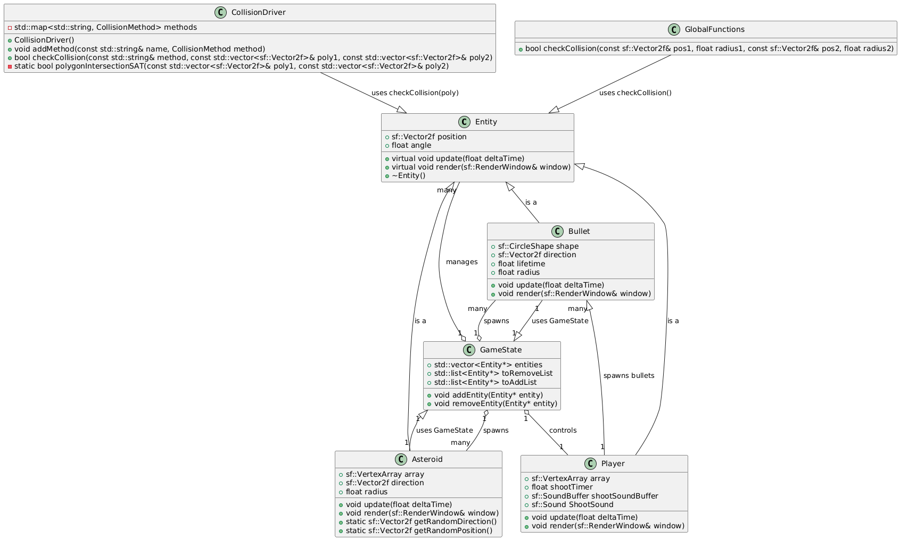
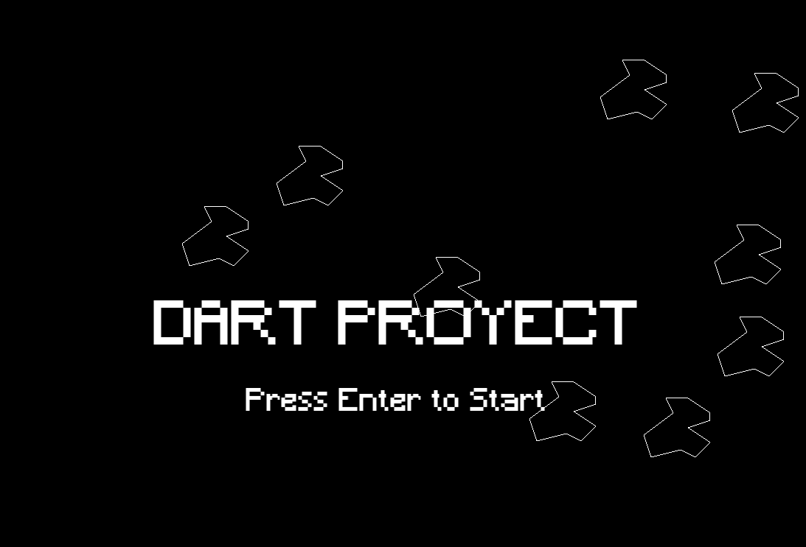
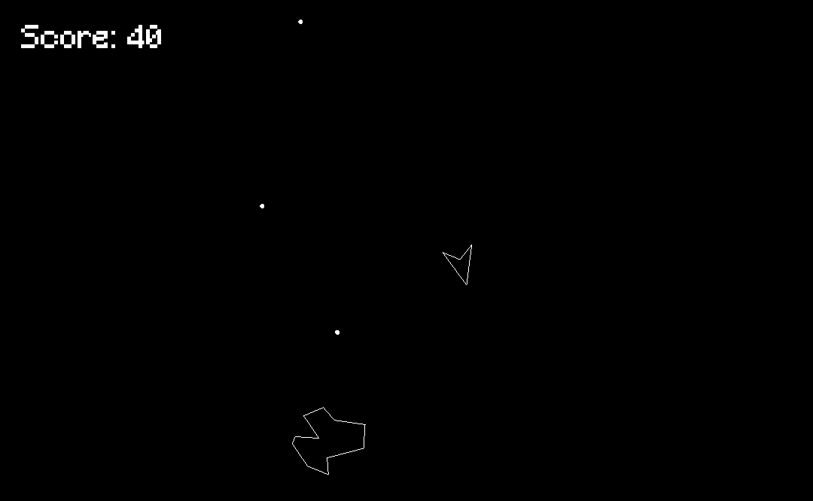
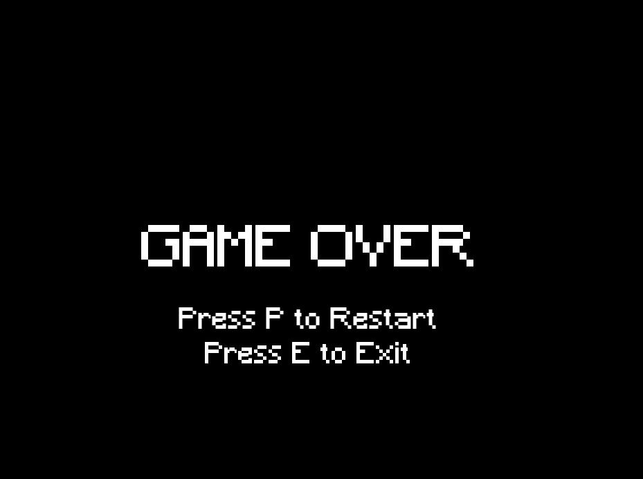

# Dart Project

The project is developed on MinGW64 using Msys2, and Visual Studio Code is used as the editor.

## How to execute the codes

Install all the dependencies described below and within a vscode terminal execute:

> make run'ExecutableName'

For example, to execute '00_Ventana.cpp', run the command in the vscode terminal:

> make run00_Ventana

## Needed programs

### Visual Studio Code
Download and install vscode from the following [link.](https://code.visualstudio.com/)

### MSYS2 (Windows)

Install Msys2 using the following [link.](https://github.com/msys2/msys2-installer/releases/download/2023-05-26/msys2-x86_64-20230526.exe)

Do not modify any options during installation as it could change the configurations.

Once installed, you need to add the following directories to the Windows path and restart.

> C:\msys64\mingw64\bin

> C:\msys64\usr\bin

### GitHub Desktop
Desktop client for cloning the repository, download using the following [link](https://desktop.github.com/).

### Git
To be able to commit from vscode, you need to have Git installed, download it from the following [link](https://git-scm.com/).

## Used libraries (Msys2)

Execute the following commands in the msys2 terminal to install the necessary dependencies

### DevTools
Compilers and tools needed for development.

https://code.visualstudio.com/docs/cpp/config-mingw
> pacman -S --needed base-devel mingw-w64-x86_64-toolchain

### SFML
https://packages.msys2.org/package/mingw-w64-x86_64-sfml
> pacman -S mingw-w64-x86_64-sfml

### Box2D Physics simulation - C++
https://box2d.org/documentation/
https://packages.msys2.org/package/mingw-w64-x86_64-box2d?repo=mingw64
pacman -S mingw-w64-x86_64-box2d

## Necessary complements for VSCode

- Material Icon
- C/C++
- PlantUML
- GitGraph

# Game  

## Controls to Play
- from your keybord you have to localize the keys:
- **W** moves up
- **A** moves left
- **S** moves down
- **D** moves right
- **Space** shoots
- **p** re start
- **e** Exit

## Architecture of the classes
  

## Screens of the game

- ## Start
  

 - ## Playing
  

 - ## Game over
  